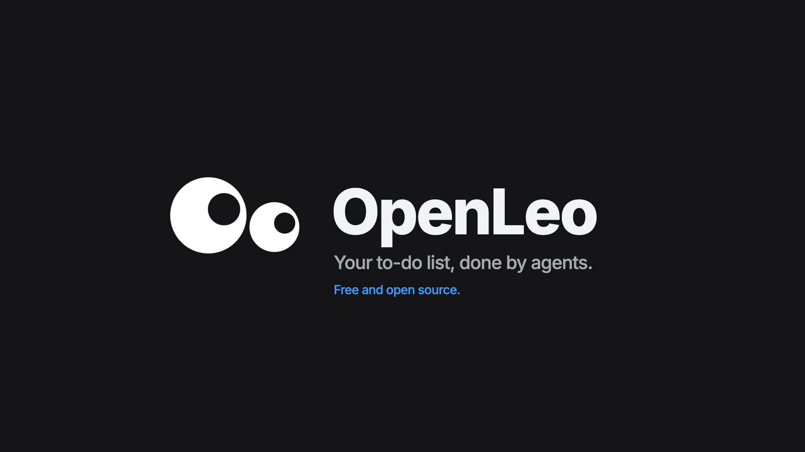
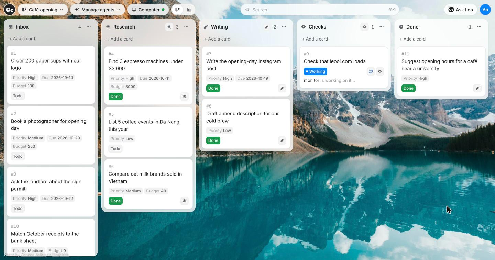
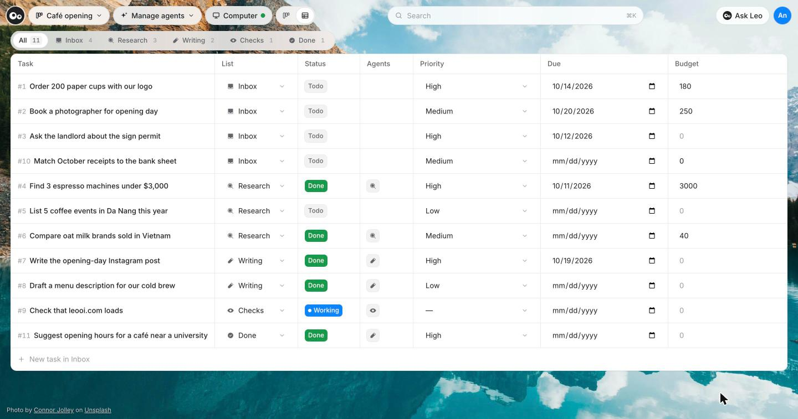
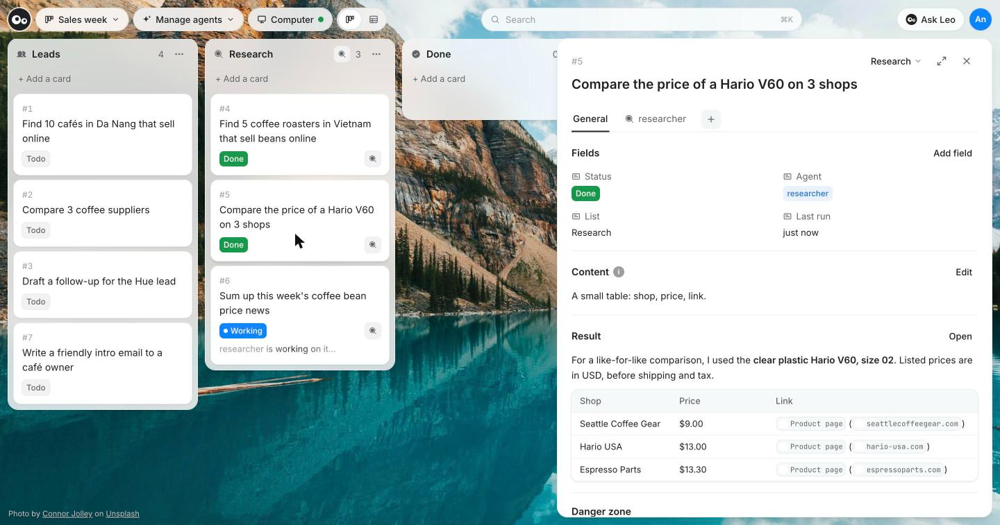

# OpenLeo

[](https://github.com/ancs21/openleo/releases/latest)
[](https://github.com/ancs21/openleo/actions/workflows/desktop.yml)
[](LICENSE)

> **Work in progress.** Expect rough edges; back up your data before updating.

A to-do board like Trello, where AI agents do the cards on their own computer. You sign in with ChatGPT, like Codex, so agents run on the plan you already have. No code needed.

[](landing/intro.mp4)

Each list can have its own agent. Drop a card in Research and the researcher picks it up; drop one in Writing and the writer does:



The same board as a table, with your own fields like priority, due date and budget:



When an agent finishes, its answer stays on the card:



## Run

```bash
bun install
bun run dev     # http://127.0.0.1:3000
```

Agents need a computer: Apple's `container` tool on macOS 26+, or Docker Desktop. On first launch OpenLeo walks you through installing one and sets up the computer for you.
Sign in with ChatGPT. The first account owns the install; each account gets its own private boards, agents and computers.
Secrets stay in `vault.json`, readable by your user only.

**Desktop app** (macOS, Windows, Linux): `bun run app:build` builds for the machine you run it on (output in `artifacts/`). The *Desktop app* GitHub workflow builds all of them; push a `v*` tag to attach them to a release.

## Settings

Optional, in `.env`. The main ones:

| Variable | Default | |
|---|---|---|
| `OPENLEO_SANDBOX_ON` | auto | `apple` (native, macOS 26+) when this Mac has it, else `local` (Docker); or `cloud` |
| `UNSPLASH_ACCESS_KEY` | | Search all of Unsplash for wallpapers (without it: 100 built-in photos) |

Everything else is in [`.env.example`](.env.example).

## Hosting

OpenLeo listens on `127.0.0.1` only, and won't listen on the network without HTTPS.

To use it on your own phone or laptop, turn on **Open on your other devices** in the account menu: OpenLeo serves
HTTPS on this computer's Tailscale address, so only devices in your Tailscale network can reach it, and your own devices
come straight in ([guide](https://leooi.com/blog/tailscale)).

To host it for others, put it behind an HTTPS proxy:

```bash
OPENLEO_PUBLIC_URL=https://openleo.example OPENLEO_TRUST_PROXY=1 bun run start
```

Or serve HTTPS directly: `OPENLEO_HOST=0.0.0.0 OPENLEO_TLS_CERT=… OPENLEO_TLS_KEY=…`.

- **Sign-in** on a public address needs an OAuth client from OpenAI: set `OPENLEO_CHATGPT_CLIENT_ID` (callback `<public url>/auth/callback`).
- **Live desktop** for remote visitors needs cloud computers (`OPENLEO_SANDBOX_ON=cloud`).

## Contributing

Issues and PRs welcome. Run `bun test` and `bunx tsc --noEmit` first.
Security problems: report them privately, not in an issue (see [SECURITY.md](SECURITY.md)).

## License

[AGPL-3.0](LICENSE) · [Third-party notices](THIRD_PARTY_NOTICES.md)
